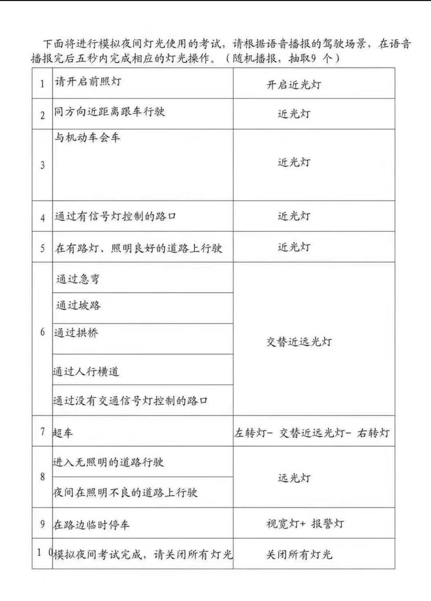
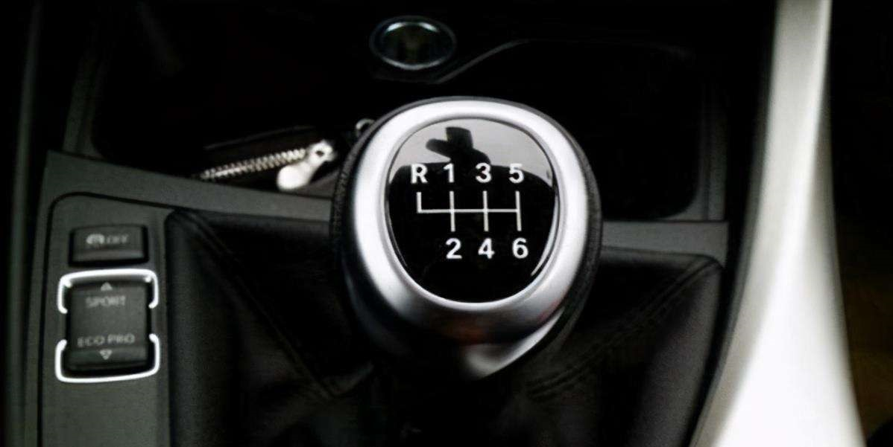

# 驾照

## 1 科目一

### 1.0 驾驶证申请

(1) 准许申请考证时间

18岁以上，

(2) 车型问题准驾

| 代号 | 准驾车型                                                     | 包含其它车型      | 备注 |
| ---- | ------------------------------------------------------------ | ----------------- | ---- |
| A1   | 大型客车                                                     | B1 B2 C1 C2 C3 C4 |      |
| A2   | 重型牵引挂车                                                 | C6                |      |
| B1   | 中型客车                                                     |                   |      |
| B2   | 大型货车 重型中型载货汽车 重型中型专项作业车                 |                   |      |
| C1   | 小型汽车                                                     | C2\C3\C4          |      |
| C2   | 小型、微型自动挡载客汽车以及轻型、微型自动挡载货汽车；轻型、微型自动挡专项作业 |                   |      |
| C3   | 低速载货汽车                                                 |                   |      |
| C4   | 三轮汽车                                                     |                   |      |
| C6   | 轻型牵引挂车                                                 |                   |      |
| D    | 三轮摩托车                                                   | E F               |      |
| E    | 普通二轮摩托车                                               | F                 |      |
| F    | 轻便摩托车                                                   |                   |      |
| M    | 轮式专用机械车                                               |                   |      |
| N    | 无轨电车                                                     |                   |      |
| P    | 有轨电车                                                     |                   |      |

(2) 驾驶证有效期: 

|      | 首领 | 过期换证 | 10年后再次换证 | 70岁以上 | 大车     |
| ---- | ---- | -------- | -------------- | -------- | -------- |
|      | 6年  | 10年     | 长期           | 一年一审 | 一年一审 |

(3) 换证

驾驶证: 核发地及居住地车管所(交通管理部门不受理这事)

行驶证: 登记地

(4) 重考

假一吊二撤三醉五追(开车相追逐)五逃终生

(5) 假材料500元，弄虚作假1000元，贿赂欺骗2000元(组织贿赂欺骗五倍，十万)

### 1.1 高速

(1) 安全距离

| 100km/h       | <100km/h       |
| ------------- | -------------- |
| 100米以上距离 | 不少于50米距离 |

(2)  车道速度

|        | 右第1车道        | 右第2车道         | 右第3车道         |
| ------ | ---------------- | ----------------- | ----------------- |
| 两车道 | 60km/h - 100km/h | 100km/h - 120km/h | --                |
| 三车道 | 60km/h - 90km/h  | 90km/h - 110km/h  | 110km/h - 120km/h |

(3) 能见度

| 能见度    | 车速   | 距离         | 车灯                                           | 助记    |
| --------- | ------ | ------------ | ---------------------------------------------- | ------- |
| 小于200米 | 60km/h | >100m        | 雾灯、近光灯、示廓灯、前后位灯                 | 261     |
| 小于100米 | 40km/h | >50m         | 雾灯、近光灯、示廓灯、前后位灯、危险报警闪光灯 | 145     |
| 小于50米  | 20km/h | 尽快离开高速 | 雾灯、近光灯、示廓灯、前后位灯、危险报警闪光灯 | 25离(0) |

(4) 其它

高速公路逆行(高速倒车和逆行一样严重，还有穿越隔离护栏掉头的)12分，违停9分，占(应急)道6分，不按车道行驶3分，(太)低速3分。

###  1.2 车速类

(1) 超速

|          | 10%~20%      | 20%-50%   | 50%以上   | 助记                         |
| -------- | ------------ | --------- | --------- | ---------------------------- |
| 七座以下 | 普通路不扣分 | 普通路3分 | 普通路6分 | 小车普通路3、6，高速分别两倍 |
| 七座以下 | 高速都不扣分 | 高速6分   | 高速12分  |                              |
| 七座以上 | 普通路1分    | 普通路6分 | 普通路9分 |                              |
| 七座以上 | 高速6分      | 高速12分  | 高速12分  | 七座以上以20%为界，6分、12分 |
| 校车     | 高速6分      | 高速12分  | 高速12分  |                              |

### 1.3 客车超载

|              | 50%以下 | 50%~100%以下 | 100%以上 |
| ------------ | ------- | ------------ | -------- |
| 七座以下客车 | 3分     | 6分          | 12分     |
| 七座以上客车 | 6分     | 9分          | 12分     |

### 1.4 扣分

|                  | 扣分                                                  | 备注               |
| ---------------- | ----------------------------------------------------- | ------------------ |
| 年检             | 未年检小车1分，大车3分                                | 不写大小车默认小车 |
| 逆行             | 普通3分，高速12分                                     |                    |
| 涉及灯光         | 不按规定使用灯光1分，故障不开危险警报灯3分，闯红灯6分 |                    |
| 不避让行人、校车 | 3分                                                   |                    |

### 满分学习

| 分数   | 内容                                                         |
| ------ | ------------------------------------------------------------ |
| 满12分 | 学习科目一，普通为期7天，大客、重型索引车、公交车、中客、大型货车30天 |
| 满24   | 考科目一科目三                                               |
| 满36   | 考科目一科目二科目三                                         |
|        |                                                              |

### 抵分

最近三个记分周期饮酒不能抵分

最多抵六分

现场学习: 2分/小时

公益活动: 1分/小时

网络学习: 1分/半小时且考试合格

### 1.5 罚款

|                     |      |
| ------------------- | ---- |
| **罚款20~200元**    |      |
| **罚款200~500元**   |      |
| **罚款200~2000元**  |      |
| **罚款2000~5000元** |      |

办理

###  1.6 事故 

|      | 坐牢3年以下或拘役 | 坐牢3-7年  | 坐牢7年以上                                              |
| ---- | ----------------- | ---------- | -------------------------------------------------------- |
|      | 出事故没逃逸      | 出事故逃逸 | 出事故逃逸且致人死亡（出事故死亡但不是由逃逸导致的不算） |

### 1.7 车牌

| 不按规定安装机动车号牌(安装但不规范) | **未悬挂**机动**车号牌**或者**故意遮挡**、**污损**机动车号牌(看不见车牌的) | **伪造、变造**的机动**车号牌、**行驶证、驾驶证、校车标牌或者使用其他机动车号牌、行驶证(伪造、张冠李戴的) |
| ------------------------------------ | ------------------------------------------------------------ | ------------------------------------------------------------ |
| 3分                                  | 9                                                            | 12                                                           |

### 1.8 常见车辆功能英文缩写

| 缩写                  | 英文                                      | 中文                   | 备注                                        |
| --------------------- | ----------------------------------------- | ---------------------- | ------------------------------------------- |
| ACC                   | Adaptive Cruise System                    | 自适应巡航系统         |                                             |
| LDW(S)                | Lane Departure Warning (System)           | 车道偏离预警系统       |                                             |
| ETC                   |                                           | 电子收费               |                                             |
| GPS GNSS         |                                           | 车辆导航系统           |                                             |
| FCW                   | Forward Collision Warning                 | 前方防碰撞预警系统     |                                             |
| CCS                   | Cruise Control System                     | 定速巡航系统           |                                             |
| EBD                   | Electronic Brakeforce Distribution        | 车辆电子制动力分配系统 |                                             |
| EBA                   | Electronic Brake Assist                   | 车辆紧急制动辅助系统   |                                             |
| TSR                   | Traffic Sign Recognition                  | 车辆交通标志识别系统   |                                             |
| BSD                   | Blind Spot Detection                      | 车辆盲点监测系统       |                                             |
| BSA                   | Blind Spot Assist                         | 车辆盲点辅助系统       |                                             |
| TCS ASR TRC | Traction Control System ASR TRC | 车辆牵引力控制系统     |                                             |
| ALC                   | Auto Lane Change                          | 车辆自动变道辅助系统   |                                             |
| AEB                   | Autonomous Emergency Braking              | 车辆自动刹车辅助系统   |                                             |
| ESP                   | Electronic Stability Program              | 车身电子稳定控制系统   |                                             |
| TMC                   | Traffic Message Channel                   | 实时交通信息           |                                             |
| AFS                   | Adaptive Front-Lighting System            | 随动转向前照灯系统     | 易错，灯光是Lighting,但人家是Front-Lighting |
| ABS                   | Anti-lock Braking System                  | 刹车防抱死系统         |                                             |

注:

adaptive: 适应的

blind: 盲的

brake: 刹车

collision: 碰撞

cruise: 巡航

departure: 分离、偏离

electronic: 电子的

forward: 向前的

lane: 车道

stability: 稳定

spot: 地点

traction: 索引力

## 2 科目二

### 2.1 倒车入库

(1) 右倒库

挂一档，松离合半联动(稳住)松刹车，正对道路中间靠左数第一和第二根虚线中间行驶，身子过黄虚线（训练场是右边柱子）就踩离合轻踩刹车(速度低，不必重踩，否则车子抖动厉害)停车，挂倒档，松离合半联动(稳住松刹车)，看左边柱子（是项目标牌的柱子）与肩膀平行右打满，看右后视镜，看到车门把碰到右虚线中间（即与库角距离20cm-30cm），回半圈不动，等待车身与库线平行，最后一圈回正，继续倒(可以协助左后视镜看是不是平行，视情况左右调，哪边宽往哪边往哪边打半圈)，看左边的树与肩膀平行停车

(2) 左倒库

同理

### 2.2 侧方停车

车子对准右数第二根虚线右侧(有箭头所对的位置)，往前开，开过了右侧的竿子一小段距离停车，挂倒档起步，看右边竿子到肩膀，方向盘右打死，看左边后视镜，看到铁挡最右边端点(训练场是一个大石头)，立马回正(压一点离合控制车速)，伸头看左车轮即将压库线方向盘左打死，继续倒车，看左后视镜车身平行(后窄前宽)停车，方向盘不用回，打左转灯，挂一档起步出库，左后视镜看到刚才的铁挡最右边端点（训练场是石头点位）方向盘回正，必要右打一圈继续前行！

### 2.3 S弯道行驶

（1号线右转/3号线左转，以右边1号线为例，对准入口隔离一个车道，右边弯线肩膀即将平行方向盘右打死，看左边的弯线到车头中间回半圈，看前方S入口，车正了回正，2号线直行）看车头左边压边线左打一圈，看左边后视镜下边，(不用立马判断，过一会看趋势)慢慢变窄即可，如果变宽再左加90度，合适了及时回90度，左边车头即将压边线回正，等车头右边即将压边线右打一圈，看右边后视镜下边，(不用立马判断，过一会看趋势)慢慢变窄即可，如果变宽再右加90度，合适了及时回90度，看前方车身即将直回正(不要等完全直，即将直就要回正，保护右边库脚不被压)，去下一个项目

### 2.4 窄路掉头

项目要求轮子不压线即可，偏道路右侧直行车头即将盖控制线（未实际盖），方向盘左打死，看左后视镜过了黄线(训练场是马路牙子)20CM停车，挂倒档，方向盘右打死，起步，看左后轮接近黄线(训练场是马路牙子)停车，挂一档，方向盘左打死，起步，中间线到车头中间回正

### 2.5 闸机起落杆

从道路中间平稳靠近，等候杆起通过即可

### 2. 6 应急停车

没听到声音不要停车，听到“前方障碍物”，踩离合踩刹车停车，打开危险警报灯，4秒后关掉危险警报灯，接着起步

### 2.7 坡道定点(只限手动档)

 进去项目前停车再起步更稳，起步方向盘中心点标牌点位对准右往左数第二根虚线中间(训练场白线)，对不准左右修(修的时候过一点点再回来就正了)，直了就看左边点位，肩膀碰地面裂缝(或者白线)同时踩离合刹车，拉手刹，放手刹，慢抬离合到半联动(车身微微抖动不行，要明显抖动，或者转速表退一小格，发动机声音沉闷)稳住，慢慢松刹车，左打方向盘一点点。准备下坡时，踩一点刹车，必要时离合可以踩到底，根据车速刹车配合，去下一个项目

### 2.8 直角转弯

对准前方右数第二根虚线右侧(训练场是有白线或者石头)，进去前停车打左转向灯，再起步控制车速(这个项目不限时间的)，看左边凸起的，肩膀对准第四个关转向灯，肩膀到第五个，方向盘左打死，眼睛看前方，黄线准备到中间回半圈，车子正了回正方向盘，完成。（没听到考试结果不要解安全带）

## 3 科目三

### 3.1 路线图

上海市浦东新区周浦镇光明考场科目三路线图

(1)  1号线

_20220917121200.jpg)

(2) 2号线

_20220917121200.jpg)

(3) 3号线

_20220917121200.jpg)

(4) 4号线

_20220917121200.jpg)

### 3.2 灯光模拟

### 3.3 加减档

R档: 左靠下压前推是R档

1档: 左靠前推是1档

2档:  左靠后拉是2档

3档:  直接前推是3档

4档: 直接后拉是4档

5档: 右靠前推是5档

### 3.4 起步

1/2档不用加油，先加1挡，离合半联动，等车子平稳起步后，（保险起见就放完）重新踩死离合挂二档，离合半联动，车速带起来后完全放开离合，紧接着加油上三挡。

### 3.5 直接行驶

方向盘对箭头，加速到30km/h左右，眼睛看前方远处，感觉不直微调（幅度不要过大），听到结束直线行驶停车，一挡重新起步

### 3.6 超车

停车，打左转向灯，换一档，看左后视镜确认安全，缓抬离合启动，方向盘左打半圈，雨刮器过了左边线再右打方向半圈，车身回正停车，打右转向灯，看右后视镜确认安全后缓抬离合启动，方向盘右打半圈，雨刮器过了右边线回正，继续向前行驶

### 3.7 通过学校、公交车站

停车重启起步

### 3.8 通过路口、人行横道

停车，观察红绿灯，红绿灯在倒计时就不要过去了，等下一个绿灯

如果等信号灯的时候自己不是在最前面的，需要走到最前面重新停车挂一挡再重新起步

### 3.9 掉头

打左转向灯，先向右打半圈，一会再左打死，离合压住一半掉头

### 3.10 靠边停车

听到指令后，停车，打转向灯，三秒后，一挡起步，方向盘向右打一点点，半联动慢慢右靠，观察右边前面的镜子，30公分停车，回空档、拉手刹熄火，解安全带，开车门前确认安全，开车门下车，快速关上车门，成绩合格！

## 4 科目四

## # 参考文档

[最新科目一攻略（新规）](https://zhuanlan.zhihu.com/p/494910945)
